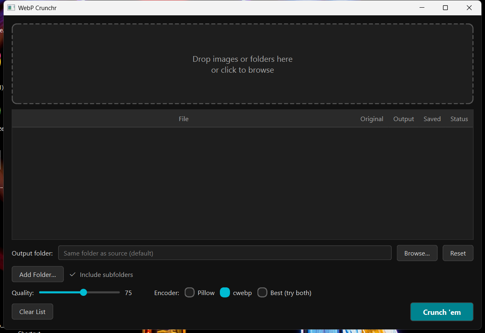
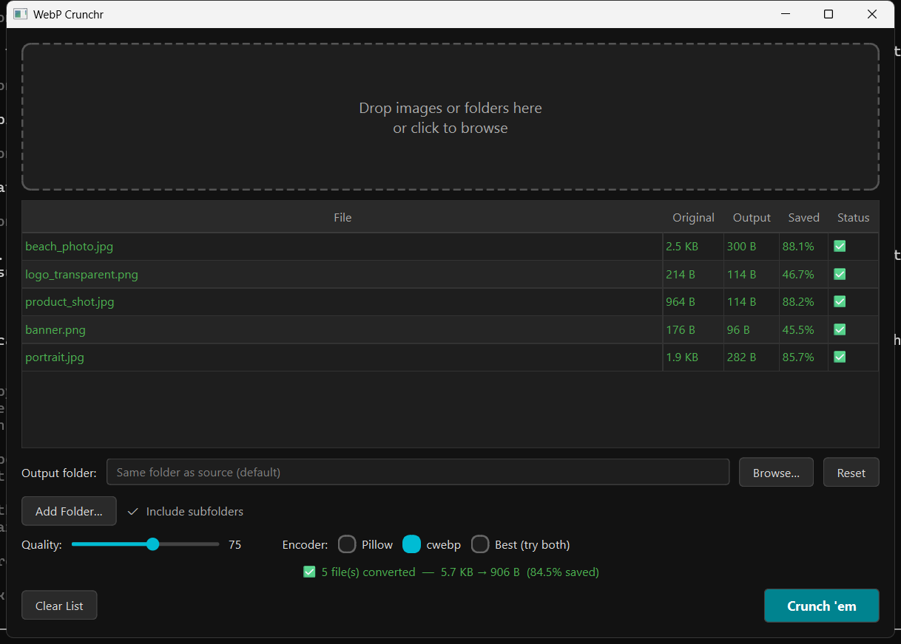

# WebP Crunchr

> Drag-and-drop batch image compressor that converts photos to WebP with maximum compression and minimal quality loss.


---

## Screenshots





---

## Features

- **Drag-and-drop** or click-to-browse batch file import
- Converts **JPEG, PNG, GIF (first frame), BMP, TIFF, HEIC** → WebP
- **Quality slider** (50–95, default 75) for fine-grained size/quality tradeoff
- **Pillow** encoding with `method=6` for maximum compression
- Optional **cwebp** backend (auto-detected on PATH) for potentially better output
- Strips all EXIF/metadata from output files
- Preserves **alpha channel** (transparency) from PNG/WebP sources
- **Per-file output folder** support; defaults to same directory as source
- Never overwrites the original file
- Non-blocking processing via **QThread** — UI stays responsive
- Per-file status icons (queued / processing / done / error) with error tooltips
- **Completion summary**: total size before → after with % saved
- Dark-themed PyQt6 UI, 700×500 minimum, fully resizable

---

## Requirements

- Python 3.11+
- PyQt6
- Pillow
- pillow-heif _(optional — required for HEIC support)_
- cwebp _(optional — see [Installing cwebp](#installing-cwebp-optional) below)_

---

## Installation

```bash
# 1. Clone the repo
git clone https://github.com/marcusbellamyshaw/webp-crunchr.git
cd webp-crunchr

# 2. Create and activate a virtual environment
python -m venv .venv
.venv\Scripts\activate

# 3. Install dependencies
pip install -r requirements.txt
```

---

## Usage

```bash
python main.py
```

1. Drag image files onto the drop zone, or click it to open a file browser.
2. Optionally set a custom output folder (defaults to the source file's folder).
3. Adjust the quality slider (lower = smaller file, higher = better quality).
4. Click **Crunch 'em** to start batch conversion.
5. Monitor per-file progress and the summary row at the bottom.

---

## Installing cwebp (optional)

`cwebp` is Google's official WebP encoder. WebP Crunchr uses Pillow by default, but if `cwebp` is on your PATH the **"Use cwebp"** checkbox activates and you can use it as an alternative backend — it occasionally squeezes out a few extra percent of compression at the same quality level.

**Windows — install in 3 steps:**

1. Download the latest prebuilt Windows zip from Google's storage bucket:
   ```
   https://storage.googleapis.com/downloads.webmproject.org/releases/webp/libwebp-1.6.0-windows-x64.zip
   ```
2. Extract the zip and copy the contents of the `bin\` folder to a permanent location, e.g. `C:\tools\cwebp\`.
3. Add that folder to your `PATH`:
   - Open **System Properties → Advanced → Environment Variables**
   - Edit the **User** `Path` variable and append `C:\tools\cwebp`
   - Open a new terminal and run `cwebp -version` to confirm

WebP Crunchr auto-detects `cwebp` at startup — just restart the app after adding it to PATH.

> **Does cwebp work with the compiled `.exe`?**
> Yes — `cwebp.exe` is **bundled inside the `.exe`** (see `vendor/`). No separate installation needed. The app checks for the bundled copy first, then falls back to any `cwebp` on your system PATH, then silently uses Pillow. The "Use cwebp" checkbox will be active out of the box.

---

## Building a standalone .exe

Requires [PyInstaller](https://pyinstaller.org):

```bash
pip install pyinstaller
build.bat
```

The compiled executable will be placed in `dist\WebP Crunchr.exe`. No Python installation required on the target machine.

---

## Contributing

1. Fork the repository
2. Create a feature branch (`git checkout -b feature/my-feature`)
3. Commit your changes following [Conventional Commits](https://www.conventionalcommits.org/)
4. Open a Pull Request describing what changed and why

Please keep PRs focused — one feature or fix per PR.

---

## About

**App design & product direction** — [Marcus Shaw](https://github.com/marcusbellamyshaw-cell)  
**Code** — [Claude Code](https://claude.ai/code) by Anthropic

---

## Third-party licenses

WebP Crunchr bundles `cwebp.exe` from Google's [libwebp](https://chromium.googlesource.com/webm/libwebp) project, which is licensed under the **BSD 3-Clause License**. The full license text is included in `vendor/LIBWEBP_LICENSE.txt` and reproduced inside the compiled `.exe`.

---

## License

[MIT](LICENSE) — free to use, modify, and distribute.
